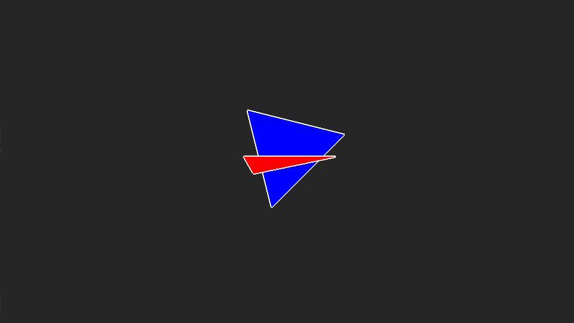

# HoekjeC

#### Logo Aanpassen:
- Een `<iconaam>`.ico aanmaken (bij voorbeeld met paint.net addon).
- Een `<rcnaam>`.rc bestand de regel `id ICON "<iconaam>.ico"` geven.
- `windres \<rcnaam>.rc -o \<coffnaam>.coff`
- In task.json `<coffnaam>.coff` toevoegen als argument onder de te schakelen bestanden (zoals de c bestanden).