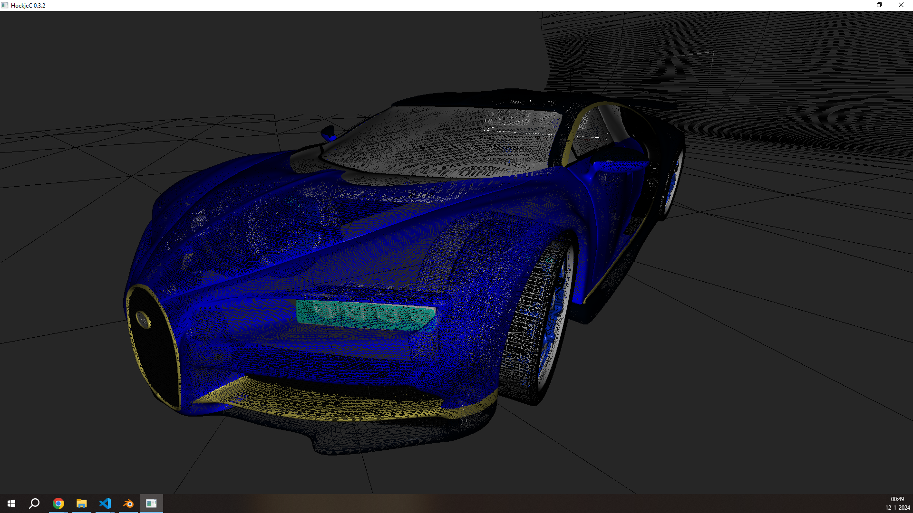

_HoekjeC is een grafische motor in aanbouw voor vermaak :)_

---

## HoekjeC
This repo is archived, though I created a refactored build that fixes some compilation issues & enables calling the example executable with an optional .obj path argument `Example.exe <obj>`

Although it was a good way to practice using C, I don't intend on making further changes to this repo (save for potentially translating the variable names used). For more see my [VertexD](https://github.com/HuskyNator/VertexD) and [Ray](https://huskynator.github.io/Ray/) repos.

## Building
A prebuilt binary is provided in the last release. Note this may not support your environment, as it's built for 64-bits Windows 10.

[CMake](https://cmake.org/) (or an IDE that uses it) is needed to build the project. Normal building will create the library file (`HoekjeC.lib`), in order to build the `Example.exe` executable as well, the `BUILD_EXAMPLE` option needs to be enabled (eg. using `cmake build -DBUILD_EXAMPLE=ON`) before calling the build commant (eg. `cmake --build build`).

Note the library will be located in `build/Debug`/`build/Release`/etc. while the executable, along with requires files will be located in `build/example/Debug`/`build/example/Release`/etc.

### Example Controls

	- w,a,s,d : horizontal/lateral movements
	- control,space : vertical movement
	- shift - faster movement
	- left mouse button : render 'normally'
	- right mouse button : render the wireframe
	- escape : close the program

Example render (default bugatti.obj):
